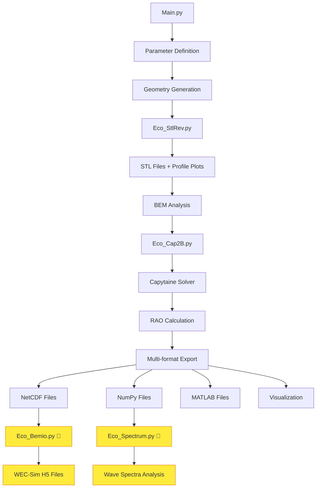

# EcoLab - Parametric Hydrodynamic Analysis Toolkit

[](https://www.python.org/downloads/)
[](https://opensource.org/licenses/MIT)
[](https://github.com/mancellin/capytaine)
[](https://wec-sim.github.io/WEC-Sim/)

A comprehensive Python toolkit for parametric hydrodynamic analysis of floating bodies, specifically designed for Wave Energy Converter (WEC) research and marine renewable energy applications.

## 🌊 Overview

EcoLab automates the complete workflow from geometry generation to hydrodynamic analysis, enabling efficient parametric studies of floating body systems. The toolkit integrates geometry creation, Boundary Element Method (BEM) analysis, and post-processing into a unified framework.

### Key Features

- **🔧 Parametric Geometry Generation**: Create STL meshes from point definitions
- **🌊 Two-Body BEM Analysis**: Coupled hydrodynamic analysis using Capytaine
- **📊 Multiple Export Formats**: NetCDF, NumPy, Pickle, and MATLAB compatibility
- **📈 Automated Visualization**: RAO plots and geometry visualization
- **🔄 Batch Processing**: Automated parametric studies
- **⚡ BEMIO Integration**: WEC-Sim compatible output (in development)
- **🌊 Wave Spectra**: JONSWAP spectrum generation (in development)

## 📁 Project Structure

```
EcoLab/
├── EcoFunctions/           # Core analysis modules
│   ├── __init__.py         # Package initialization
│   ├── Eco_StlRev.py       # STL geometry generation
│   ├── Eco_Cap2B.py        # Two-body BEM analysis
│   ├── Eco_Bemio.py        # BEMIO post-processing (🚧 Development)
│   └── Eco_Spectrum.py     # Wave spectra generation (🚧 Development)
├── Main.py                 # Main parametric analysis script
├── Default/                # Template folder structure
│   └── geometry/
│       └── plate.stl       # Reference plate geometry
└── README.md              # This file
```

## 🚀 Quick Start

### Prerequisites

```bash
pip install numpy matplotlib capytaine scipy xarray netcdf4
```

### Basic Usage

1. **Setup your project structure:**
   ```bash
   git clone https://github.com/your-repo/EcoLab.git
   cd EcoLab
   ```

2. **Prepare Default folder:**
   - Create `Default/geometry/` folder
   - Place your reference `plate.stl` file

3. **Configure parameters in `Main.py`:**
   ```python
   R_values = [3.5, 4.5, 5.5]  # Geometry parameter R
   D_values = [-1.0, -1.4]     # Geometry parameter D
   frequencies = np.linspace(0.1, 2.0, 20)  # Analysis frequencies [rad/s]
   ```

4. **Run analysis:**
   ```bash
   python Main.py
   ```

## 🔧 Core Modules

### 1. Eco_StlRev.py - Geometry Generation

Generates solids of revolution from parametric point definitions.

```python
from EcoFunctions.Eco_StlRev import generate_revolution_solid_stl

# Define geometry points
points = np.array([
    [3, 0, -2],   # P1
    [5, 0, -2],   # P2  
    [10, 0, 3],   # P3
    [3, 0, 3]     # P4
])

# Generate STL
result = generate_revolution_solid_stl(
    points=points,
    filename="float.stl",
    num_segments=36
)
```

**Features:**
- ✅ Flexible point input (minimum 3 points)
- ✅ Automatic profile closure
- ✅ STL export with normal calculation
- ✅ 2D profile visualization

### 2. Eco_Cap2B.py - BEM Analysis

Performs coupled two-body hydrodynamic analysis using Capytaine.

```python
from EcoFunctions.Eco_Cap2B import analyze_two_body_hydrodynamics

results = analyze_two_body_hydrodynamics(
    mesh1_path="float.stl",
    mesh2_path="plate.stl", 
    frequency_range=np.linspace(0.1, 2.0, 20),
    body_names=["Float", "Plate"]
)
```

**Outputs:**
- ✅ Added mass and radiation damping matrices
- ✅ Response Amplitude Operators (RAO)
- ✅ Excitation forces
- ✅ Multiple file formats (NetCDF, NPZ, PKL, MAT)

### 3. Eco_Spectrum.py - Wave Spectra 🚧

Generates realistic sea state conditions for WEC analysis.

```python
from EcoFunctions.Eco_Spectrum import create_spectrum

# Generate JONSWAP spectrum
S = create_spectrum(frequencies, Hs=2.5, Tp=8.0, spectrum_type='jonswap')
```

**Status:** 🚧 **In Development**
- ⚠️ Basic JONSWAP implementation available
- ⚠️ Additional spectra (Bretschneider, P-M) planned
- ⚠️ Full integration with BEM results pending

### 4. Eco_Bemio.py - WEC-Sim Integration 🚧

Converts Capytaine results to WEC-Sim compatible format using BEMIO.

```python
from EcoFunctions.Eco_Bemio import run_bemio_postprocessing

success = run_bemio_postprocessing(
    nc_path="rm3.nc",
    output_directory="./hydroData"
)
```

**Status:** 🚧 **In Development**
- ⚠️ MATLAB Engine API integration implemented
- ⚠️ Requires external BEMIO installation
- ⚠️ Limited testing on different systems
- ⚠️ Documentation and error handling improvements needed

## 📊 Workflow Diagram



## 📈 Output Structure

Each parametric case generates the following structure:

```
batch/
└── Geometry_R35_D10/           # Example: R=3.5, D=-1.0
    ├── geometry/
    │   ├── float.stl           # Generated geometry
    │   ├── plate.stl           # Reference geometry
    │   └── profile_plot.png    # 2D profile visualization
    └── hydroData/
        ├── rm3.nc              # Capytaine dataset (NetCDF)
        ├── HydCoeff.npz        # Hydrodynamic coefficients (NumPy)
        ├── HydCoeff.pkl        # Complete dataset (Pickle)
        ├── HydCoeff.mat        # MATLAB compatible format
        ├── RAO_heave_comparison.png
        └── geometry_lateral_view.png
```

## 🔬 Data Access Examples

### Loading Results in Python

```python
import numpy as np

# Load hydrodynamic coefficients
data = np.load('batch/Geometry_R35_D10/hydroData/HydCoeff.npz')

# Access matrices
A = data['A']           # Added mass (Nω, 12, 12)
B = data['B']           # Radiation damping (Nω, 12, 12)  
RAO = data['RAO']       # Response Amplitude Operator (12, Nω)
frequencies = data['w'] # Frequencies [rad/s]

# Float heave RAO
RAO_float_heave = RAO[2, :]  # DOF 2 = heave of first body
```

### Loading Results in MATLAB

```matlab
% Load MATLAB format
load('batch/Geometry_R35_D10/hydroData/HydCoeff.mat')

% Variables available: A, B, RAO, w, etc.
% Complex variables separated: Fe_real, Fe_imag

% Reconstruct complex excitation force
Fe_complex = Fe_real + 1i*Fe_imag;
```

## ⚙️ Configuration Options

### Main.py Configuration

```python
# Output folder
FOLDER_NAME = "batch"

# Parameter ranges  
R_values = [3.5, 4.5, 5.5, 6.5, 7.5, 8.5, 9.5]
D_values = [-1.0, -1.4, -1.8, -2.2, -2.6, -3.0]

# Analysis settings
frequencies = np.linspace(0.1, 2.0, 20)  # [rad/s]

# BEMIO post-processing (requires MATLAB + BEMIO)
RUN_BEMIO = False  # 🚧 Set True if BEMIO is available
```

### BEM Analysis Options

```python
results = analyze_two_body_hydrodynamics(
    mesh1_path="float.stl",
    mesh2_path="plate.stl",
    frequency_range=frequencies,
    mesh1_position=[0.0, 0.0, 0.0],    # Float position
    mesh2_position=[0.0, 0.0, -20.0],  # Plate position  
    wave_direction=0.0,                 # Wave heading [rad]
    logging_level="INFO"               # Capytaine logging
)
```

## 🚧 Development Status

### ✅ Fully Implemented
- ✅ Parametric STL geometry generation
- ✅ Two-body BEM analysis with Capytaine
- ✅ RAO calculation and visualization
- ✅ Multi-format data export (NetCDF, NumPy, Pickle, MATLAB)
- ✅ Automated batch processing

### 🚧 In Development

#### Eco_Bemio.py - BEMIO Integration
**Status:** Beta implementation
- ✅ MATLAB Engine API integration
- ✅ Basic BEMIO script generation
- ⚠️ **Limitations:**
  - Requires manual BEMIO installation
  - Limited cross-platform testing
  - Error handling needs improvement
  - Documentation incomplete

#### Eco_Spectrum.py - Wave Spectra
**Status:** Alpha implementation  
- ✅ Basic JONSWAP spectrum generation
- ⚠️ **Limitations:**
  - Only JONSWAP implemented
  - No integration with power calculations
  - Missing validation against standard implementations
  - Additional spectra (Bretschneider, P-M, TMA) planned

### 🔮 Planned Features
- Advanced post-processing tools
- Power absorption calculations with wave spectra
- Fatigue analysis capabilities  
- Multi-directional wave analysis
- Optimization framework integration

## 📋 Requirements

### Core Dependencies
```
numpy >= 1.19.0
matplotlib >= 3.3.0  
capytaine >= 1.4.0
scipy >= 1.5.0
xarray >= 0.16.0
```

### Optional Dependencies
```
netcdf4             # Enhanced NetCDF support
matlab.engine       # BEMIO integration (🚧)
```

### External Software (Optional)
- **MATLAB + BEMIO**: For WEC-Sim compatible output
- **Paraview/MeshLab**: For STL visualization

## 🤝 Contributing

Contributions are welcome! Areas needing development:

1. **BEMIO Integration**: Improve cross-platform compatibility
2. **Wave Spectra**: Add additional spectrum types
3. **Validation**: Comparison with analytical solutions
4. **Documentation**: Usage examples and tutorials
5. **Testing**: Unit tests and continuous integration

## 📚 References

- **Capytaine**: Boundary Element Method solver ([Documentation](https://capytaine.github.io/))
- **WEC-Sim**: Wave Energy Converter Simulator ([Website](https://wec-sim.github.io/WEC-Sim/))
- **BEMIO**: Boundary Element Method Input/Output ([GitHub](https://github.com/WEC-Sim/BEMIO))

## 📄 License

This project is licensed under the MIT License - see the [LICENSE](LICENSE) file for details.

## 👨‍💻 Author

**Pablo Antonio Matamala Carvajal**
- Email: [your-email@domain.com]
- Institution: [Your Institution]
- Research Focus: Wave Energy Conversion, Marine Renewable Energy

## 🔗 Citation

If you use EcoLab in your research, please cite:

```bibtex
@software{matamala2025ecolab,
  title={EcoLab: Parametric Hydrodynamic Analysis Toolkit},
  author={Matamala Carvajal, Pablo Antonio},
  year={2025},
  url={https://github.com/your-repo/EcoLab}
}
```

---

**Note:** This toolkit is under active development. Features marked with 🚧 are experimental and may change in future versions. Please report issues and contribute to improve the software!
